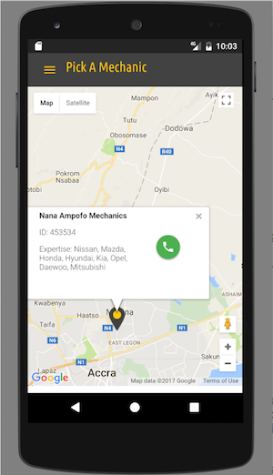

<h3>MOVEIT MOBILE APPLICATION</h3>
This is a cross-platform mobile application that enables drivers to find and connect to close by mechanics and tow operators when their vehicles break down. This reduces the time and cost in looking for mechanics and tow operators in unknown areas.

<h4>Built with</h4>
<ul>
  <li><a href="http://materializecss.com">Materialize</a></li>
  <li><a href="https://developers.google.com/maps/">Google Maps</a></li>
  <li><a href="http://cordova.apache.org/">Apache Cordova</a></li>
</ul>

